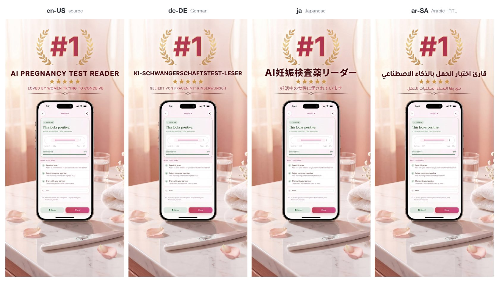
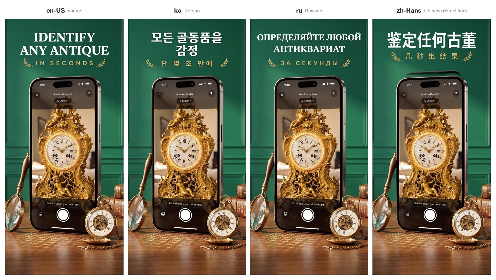

# App Store Localization — a Claude Code skill

[](LICENSE)
[](https://docs.claude.com/en/docs/claude-code)
[](https://www.python.org/)

Localize an iOS app's **App Store listing** — metadata *and* screenshots — into
many locales at maximum quality, then ship it the way you prefer.

It orchestrates three things:

- **Gemini MCP** — translates the marketing copy, and translates the caption text
  *inside* each screenshot.
- **Astro ASO MCP** — discovers and **validates** keywords against real
  per-storefront popularity/difficulty data (so the keyword field is *optimized*,
  not just translated).
- **Python (Pillow + numpy)** — composites the translated caption back onto the
  pristine screenshot so the in-phone app UI stays pixel-sharp, and lints metadata
  against Apple's field limits.

Output lands in the standard fastlane layout (`metadata/<locale>/*.txt`,
`screenshots/<locale>/*.png`), ready to upload — by hand or with `fastlane
deliver`.

---

## Real results

Two production apps shipped their App Store presence through this skill —
**24 localized metadata sets and 114 localized screenshots** between them,
each app localized end-to-end in **under 10 minutes**.
Everything below is unedited output: one English source screenshot in, a
localized set out, the in-phone app UI bit-identical across every locale.

### AI Pregnancy Test Checker — metadata in 12 languages



### Antique Identifier — metadata + screenshots in 13 languages



Note the Arabic panel: right-to-left script, correct diacritics, same layout —
and the phone UI under it never went through an image model, so it stays
pixel-sharp. The decorative laurels, stars and dividers survive untouched
thanks to the glyph + colour diff mask.

### The metadata reads native, and it all fits

Subtitles from the shipped fastlane metadata (Apple's limit is 30 characters):

| Locale | AI Pregnancy Test Checker | Antique Identifier |
| --- | --- | --- |
| 🇩🇪 `de-DE` | Schwangerschaftstest KI-App | Antiquitäten per Foto schätzen |
| 🇯🇵 `ja` | うっすら陽性も写真でAI判定 | 写真でお宝を鑑定・価値査定 |
| 🇰🇷 `ko` | 희미한 선 AI 판독·양성 음성 임신테스트 | 사진으로 빈티지·수집품 가치 감정 |
| 🇷🇺 `ru` | ИИ сканер: слабая полоска | Оценка винтажа по фото |
| 🇸🇦 `ar-SA` | حاسبة و ماسح الحمل بالذكاء | صوّر التحف والمقتنيات وقيّمها |
| 🇨🇳 `zh-Hans` | AI拍照秒读 浅线置信分析 | 拍照鉴定古董收藏品 估价更轻松 |

Running `scripts/check_metadata.py` over both apps' full metadata trees:
**no errors across all 25 locale sets** — every subtitle ≤ 30, every keyword
field ≤ 100, every description ≤ 4000.

### Keywords are researched, not translated

A few things a literal translation of the English keyword list could never
produce — these came out of Astro's per-storefront popularity data:

- **Japanese** (pregnancy): targets ドゥーテスト — Rohto's *Do-Test*, a test
  brand that only exists in Japan — plus 妊活 ("ninkatsu", the Japanese
  trying-to-conceive culture word) and 基礎体温 / 高温期, the BBT-charting
  terms Japanese users actually search.
- **Korean** (antiques): 청자 and 백자 — Goryeo celadon and Joseon white
  porcelain, the categories Korean collectors search for.
- **Turkish** (antiques): *mezat* (auction) and *çini* (İznik tilework).
- **Russian** (antiques): *клеймо* (maker's hallmark) and *барахолка*
  (flea market).
- **German** (pregnancy): *Kinderwunsch* and *Frühtest* — the vocabulary of
  the German TTC community, not dictionary translations of "pregnancy test".

---

## Why this exists

**Screenshots.** Image models cap their output around a ~1500px long edge. Feed a
whole 1290×2796 store screenshot in and you get a smaller image back that has to be
upscaled — blurry text and a soft phone UI. This skill instead translates **only
the caption band** (short → the model's output is a *downscale* to the screenshot
width = crisp) and composites it back onto the untouched original. A glyph + colour
diff mask means highlight blobs, curved shapes, arrows and squiggles stay pristine
while only the letterforms change. ([deep dive](references/screenshot-pipeline.md))

**Keywords.** Search demand differs by language and country, so literally
translating your English keywords leaves ranking on the table. This skill pulls
real popularity/difficulty numbers from Astro and **validates** the candidate set
per storefront before committing it. ([deep dive](references/keyword-research.md))

---

## Requirements

| | What | Needed for |
| --- | --- | --- |
| **Required** | Python 3.9+ with `numpy` + `Pillow` (`pip install -r requirements.txt`) | screenshot compositing + metadata linting (metadata-only runs don't need numpy) |
| **Required** | **Gemini MCP** server exposing `gemini_chat` + `edit_image` (model `gemini-3-pro-image-preview`) | translating copy and in-image captions |
| **Recommended** | **[Astro ASO MCP](https://tryastro.app?aff=pZjqo8)** server | discovering + validating localized keywords |
| **Optional (to ship)** | **fastlane** | uploading via `fastlane deliver` — skip it entirely if you upload manually |

> **No credentials live in this repo.** The scripts do local image maths and write
> text files; all API access is through your separately-configured MCP servers and
> fastlane. App Store Connect API keys, service accounts and analytics tokens must
> never be committed — `.gitignore` blocks the common ones.

---

## Installation

Install as a Claude Code skill by cloning into your skills directory:

```bash
git clone https://github.com/mazen-salah/appstore-localization \
  ~/.claude/skills/appstore-localization
pip install -r ~/.claude/skills/appstore-localization/requirements.txt
```

Then make sure your **Gemini MCP** (and ideally **Astro ASO MCP**) servers are
configured in Claude Code. Invoke it with:

```
/appstore-localization
```

or just describe the task ("localize my App Store listing into German, French and
Japanese") and Claude will pick up the skill.

You can also use the scripts directly, with or without Claude Code (see below).

---

## Scripts

### `scripts/compose.py` — screenshot caption pipeline

```bash
# 1. suggest the caption band rows for a screenshot
python scripts/compose.py detect screenshot.png

# 2. crop the caption band to send to your image model for translation
python scripts/compose.py crop screenshot.png --y0 0 --y1 700 -o band.png

# 3. composite the translated band back onto the pristine screenshot
python scripts/compose.py composite screenshot.png --y0 0 --y1 700 \
       --band band_translated.png -o out/de-DE/1.png
```

Tunables on `composite`: `--thresh` (colour-diff, default 45), `--feather`
(default 2), `--guard` (inner-edge guard rows, default 28). See
[references/screenshot-pipeline.md](references/screenshot-pipeline.md).

### `scripts/check_metadata.py` — Apple field-limit linter

```bash
python scripts/check_metadata.py ios/fastlane/metadata
python scripts/check_metadata.py ios/fastlane/metadata --locale en-US
```

Flags name/subtitle/keywords/promo/description/release-notes over Apple's limits,
plus wasted spaces, duplicate keywords, and keywords already in name/subtitle.
Pure standard library, no dependencies. Exit code is non-zero if any hard limit is
exceeded (handy in CI).

---

## Repository layout

```
.
├── SKILL.md                          # the Claude Code skill (workflow + frontmatter)
├── README.md
├── LICENSE
├── requirements.txt
├── scripts/
│   ├── compose.py                    # screenshot band-translate + composite
│   └── check_metadata.py             # App Store field-limit linter
├── references/
│   ├── screenshot-pipeline.md        # compose.py internals + tuning
│   ├── prompt-templates.md           # ready-to-use Gemini prompts (incl. RTL/CJK)
│   └── keyword-research.md           # Astro discover → validate → pack
└── docs/
    └── results/                      # real output from two shipped apps (see "Real results")
```

---

## Shipping

The skill asks how you want to ship — it never uploads on its own:

- **Manual** — it prints each locale's fields ready to paste into App Store Connect
  and points to the screenshot folder to drag in. You're the final gate.
- **fastlane** — `fastlane deliver` (metadata and/or screenshots), scoped to the
  locales that actually exist on App Store Connect. Uploading needs an ASC API key
  *you* provide; it's never stored here.

Uploading metadata/screenshots does **not** submit for review or change the app
version — that stays an explicit, separate decision.

---

## Limitations

- Designed for the App Store (fastlane `deliver` layout). The screenshot technique
  is store-agnostic, but the metadata/keyword rules are Apple's.
- Band detection (`detect`) is a heuristic starting point — always eyeball the
  crop and adjust `--y0/--y1`.
- Translation quality is the image/text model's; always review returned bands for
  spelling and fit, especially RTL and CJK.
- The skill produces files and hands off; it does not manage certificates,
  provisioning, or App Review submission.

## License

[MIT](LICENSE) © 2026 Mazen Tamer Salah

## Acknowledgements

Built as a reusable Claude Code skill for shipping indie iOS apps to a global
audience. Pairs well with a screenshot-*generation* skill (to create the English
base screenshots) and an App Store review pre-flight skill.
